<h1 align="center">👋 Hai, Saya Salman Yuris Adila Azzami</h1>

  

<!-- Animasi Sambutan & Maskot Kucing Koding Lucu -->

  

  
  &nbsp;&nbsp;&nbsp;&nbsp;&nbsp;&nbsp;&nbsp;&nbsp;&nbsp;&nbsp;&nbsp;&nbsp;&nbsp;&nbsp;&nbsp;&nbsp;&nbsp;&nbsp;&nbsp;&nbsp;&nbsp;&nbsp;&nbsp;&nbsp;&nbsp;&nbsp;&nbsp;&nbsp;
  

## 🌟 Tentang Saya

<table border="0" width="100%">
  <tr>
    <td>
      
✨ Halo! Saya <strong>Salman Yuris</strong>. Saya adalah seorang <strong>Junior IT Quality Assurance</strong> yang berdedikasi tinggi untuk memastikan kualitas dan keandalan sistem aplikasi. Dengan gabungan pemahaman mendalam tentang pengembangan web (Web Development), desain antarmuka (UI/UX), dan analisis data, saya mampu melakukan pengujian produk digital secara menyeluruh dari sisi fungsionalitas hingga pengalaman pengguna akhir.

      <ul>
        <li>🛡️ <strong>Misi QA:</strong> Menemukan bug sebelum pengguna menemukannya, memastikan stabilitas kode, dan menjaga kualitas rilis produk.</li>
        <li>💡 <strong>Filosofi:</strong> <em>"Software yang hebat tidak hanya dibangun dengan kode yang bersih, tetapi juga diuji dengan standar yang tinggi."</em></li>
      </ul>
    </td>
  </tr>
</table>

## 🧰 Kategori Kompetensi & Tools

<table border="0" width="100%">
  <tr>
    <td width="50%" valign="top">
      <h3>🛡️ Quality Assurance</h3>
      
Membuat skenario pengujian, test cases, otomatisasi tes, dan pengujian API.

      
    </td>
    <td width="50%" valign="top">
      <h3>💻 Web Development</h3>
      
Mengerti arsitektur aplikasi untuk mempermudah pelacakan dan analisis bug.

      
    </td>
  </tr>
  <tr>
    <td width="50%" valign="top">
      <h3>🗄️ Database & Cloud</h3>
      
Mengelola basis data pengujian dan memahami infrastruktur sistem.

      
    </td>
    <td width="50%" valign="top">
      <h3>🎨 UI/UX & Data Analysis</h3>
      
Menganalisis kegunaan antarmuka dan visualisasi metrik performa.

      
    </td>
  </tr>
</table>

## 🐛 Mode Hunter Bug (QA Life)

<table border="0" width="100%">
  <tr>
    <td width="15%" align="center">
      
    </td>
    <td width="85%">
      <blockquote>
        <strong>Mantra QA Hari Ini:</strong> <em>“Menulis kode itu seni, tapi menemukan bug di dalamnya adalah kepuasan yang tiada tara.”</em> 🔍💥
      </blockquote>
      

        
<strong>🎮 Lihat Alur Kerja Debat Bug (Developer vs QA)</strong>

        <ol>
          <li>🔍 <strong>QA:</strong> "Ada bug di halaman login, ini test casenya."</li>
          <li>🗣️ <strong>Developer:</strong> "Tapi di laptop saya jalan aman kok!" 🤷‍♂️</li>
          <li>🧪 <strong>QA:</strong> "Coba tes di staging dengan data uji ini."</li>
          <li>💡 <strong>Developer:</strong> *hening sejenak* ... "Oh iya, lupa di-deploy." 😹</li>
          <li>✅ <strong>Hasil Akhir:</strong> Aplikasi stabil dan siap rilis!</li>
        </ol>
      

    </td>
  </tr>
</table>

## 🏆 Dashboard Pencapaian & Statistik

  

<table border="0" width="100%">
  <tr>
    <td width="50%" align="center">
      
    </td>
    <td width="50%" align="center">
      
    </td>
  </tr>
  <tr>
    <td colspan="2" align="center">
       
      
    </td>
  </tr>
</table>

## 🌐 Mari Terhubung!

Punya pertanyaan, tawaran kolaborasi, atau ingin berdiskusi seputar QA & Web Development? Silakan hubungi saya melalui platform berikut:

  
  &nbsp;&nbsp;
  
  &nbsp;&nbsp;
  

