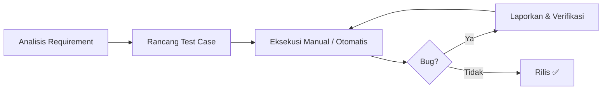

<div align="center">

<a href="https://git.io/typing-svg">
  
</a>
<br/>


</div>
<p align="center">
  
</p>
---
`~/about.ts`
```typescript
const salman: QAEngineer = {
  name: "Salman Yuris Adila Azzami",
  role: "Junior IT Quality Assurance",
  location: "Indonesia 🇮🇩",

  mission: "Menemukan bug sebelum pengguna menemukannya",
  philosophy: "Software hebat dibangun dengan kode bersih, dan diuji dengan standar tinggi.",

  strengths: [
    "Functional & regression testing",
    "API testing & test automation",
    "Memahami arsitektur web untuk analisis bug yang lebih cepat",
    "UI/UX usability review & visualisasi metrik",
  ],

  currently: {
    learning: ["Test automation lanjutan", "CI/CD untuk testing", "Performance testing"],
    lookingFor: "Kesempatan kolaborasi & posisi QA",
  },

  funFact: () => "Ngetes dulu, baru bilang 'works on my machine' 😄",
};
```
---
`~/stack.json`
<table>
  <tr>
    <td width="50%" valign="top">
      <h4>🛡️ Quality Assurance</h4>
      <p><sub>Test case, test scenario, automation, API testing</sub></p>
      
    </td>
    <td width="50%" valign="top">
      <h4>💻 Web Development</h4>
      <p><sub>Paham arsitektur aplikasi untuk tracing & analisis bug</sub></p>
      
    </td>
  </tr>
  <tr>
    <td width="50%" valign="top">
      <h4>🗄️ Database & Cloud</h4>
      <p><sub>Data uji, query, dan pemahaman infrastruktur</sub></p>
      
    </td>
    <td width="50%" valign="top">
      <h4>🎨 UI/UX & Tooling</h4>
      <p><sub>Analisis usability dan lingkungan kerja</sub></p>
      
    </td>
  </tr>
</table>
---
`~/bug-hunter.log`
> *"Menulis kode itu seni, tapi menemukan bug di dalamnya adalah kepuasan yang tiada tara."*
<details>
<summary><b>▶ Jalankan: <code>./developer-vs-qa.sh</code></b></summary>
<br/>
```bash
[QA ]  Ada bug di halaman login, ini test case-nya.
[DEV]  Tapi di laptop saya jalan aman kok! 🤷
[QA ]  Coba tes di staging dengan data uji ini.
[DEV]  ...hening sejenak...
[DEV]  Oh iya, lupa di-deploy. 😹
[SYS]  ✔ Bug fixed. Build stable. Ready to release.
```
</details>
Alur kerja saya:

```mermaid
flowchart LR
    A[Analisis Requirement] --> B[Rancang Test Case]
    B --> C[Eksekusi Manual / Otomatis]
    C --> D{Bug?}
    D -- Ya --> E[Laporkan & Verifikasi]
    E --> C
    D -- Tidak --> F[Rilis ✅]
```
---
`~/stats.sh`
<div align="center">
<a href="https://github.com/Salmanyuris">
  
</a>
<br/><br/>


<br/>

</div>
---
`~/contact.md`
Punya pertanyaan, ide kolaborasi, atau ingin diskusi seputar QA & Web Development? Yuk terhubung:
<div align="center">
<a href="https://www.linkedin.com/in/salmanyuris/">
  
</a>
<a href="mailto:salmanyuris@gmail.com">
  
</a>
<a href="https://github.com/Salmanyuris">
  
</a>
<br/><br/>
<sub><code>exit 0</code> · Terima kasih sudah mampir! ⭐</sub>

</div>
