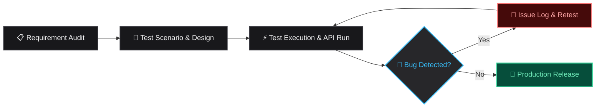

<div align="center">

# SALMAN YURIS ADILA AZZAMI
### `Junior IT Quality Assurance` • `Automation & Manual Testing`

<p align="center">
  <a href="https://linkedin.com/in/salmanyuris"></a>
  <a href="mailto:salmanyuris@gmail.com"></a>
  <a href="https://github.com/Salmanyuris"></a>
  
</p>

> *"Finding critical edge-cases and breaking bugs before real users ever encounter them."*

</div>

<br/>

<table align="center" width="100%">
<tr>
<td width="55%" valign="top">

### 🎯 About & Core Focus

Saya seorang **Junior IT Quality Assurance** dengan fondasi teknis kuat di bidang *web development*, *UI/UX*, dan analisis data. Berkomitmen menghadirkan produk digital yang stabil, reliabel, dan intuitif melalui pengujian komprehensif dari level arsitektur API hingga *user experience* akhir.

* 🔍 **Precision Testing**: Functional, Regression, Smoke & Sanity checks
* 🤖 **Automated Pipelines**: E2E web automation & API regression suites
* ⚡ **Performance & API**: Postman contract & collection runner testing
* 🎨 **UX & Accessibility**: Cross-browser & layout consistency audit

</td>
<td width="45%" valign="top">

### 💻 Developer Profile

```json
{
  "name": "Salman Yuris",
  "title": "Junior QA Engineer",
  "primary_focus": "QA Automation & Reliability",
  "core_tools": [
    "Postman", 
    "Cypress", 
    "Selenium", 
    "Python", 
    "JavaScript"
  ],
  "open_to": [
    "Full-time QA Roles",
    "Automation Projects",
    "Collaborations"
  ]
}
```

</td>
</tr>
</table>

<br/>

### 🛠️ Tech Stack & Ecosystem

<table>
  <tr>
    <td width="20%" align="center"><b>QA & Automation</b></td>
    <td>
      
      
      
      
      
    </td>
  </tr>
  <tr>
    <td width="20%" align="center"><b>Web & Scripting</b></td>
    <td>
      
      
      
      
      
    </td>
  </tr>
  <tr>
    <td width="20%" align="center"><b>Database & Cloud</b></td>
    <td>
      
      
      
      
    </td>
  </tr>
</table>

<p align="center">
  
</p>

<br/>

### 🔄 Quality Assurance Lifecycle


```mermaid
flowchart LR
    A["📋 Requirement Audit"] --> B["📝 Test Scenario & Design"]
    B --> C["⚡ Test Execution & API Run"]
    C --> D{"🐞 Bug Detected?"}
    D -- "Yes" --> E["🚩 Issue Log & Retest"]
    E --> C
    D -- "No" --> F["🚀 Production Release"]

    classDef default fill:#18181b,stroke:#3f3f46,stroke-width:1.5px,color:#f4f4f5;
    classDef check fill:#27272a,stroke:#38bdf8,stroke-width:2px,color:#38bdf8;
    classDef bug fill:#450a0a,stroke:#f87171,stroke-width:2px,color:#fca5a5;
    classDef release fill:#064e3b,stroke:#34d399,stroke-width:2px,color:#6ee7b7;

    class A,B,C default;
    class D check;
    class E bug;
    class F release;
```

<br/>

### 📊 GitHub Activity & Analytics

<div align="center">
  
  
</div>

<p align="center">
  
</p>

<br/>

---

<div align="center">

### 📬 Let's Connect & Collaborate

Apakah Anda membutuhkan pengujian sistem, otomatisasi pengetesan, atau kolaborasi *web development*?

[**LinkedIn Profile**](https://linkedin.com/in/salmanyuris) &nbsp;•&nbsp; [**Send Email**](mailto:salmanyuris@gmail.com) &nbsp;•&nbsp; [**GitHub Repository**](https://github.com/Salmanyuris)

<sub>Crafted with passion for software quality & reliability. Always test before launch! 🚀</sub>

</div>
