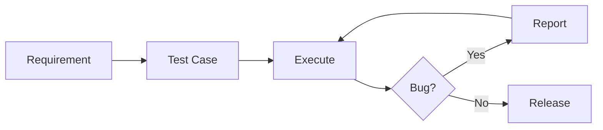

<h1 align="center">Salman Yuris Adila Azzami</h1>

<p align="center">
  Junior IT Quality Assurance<br/>
  <sub>Manual & automation testing · API testing · Web development</sub>
</p>

<p align="center">
  <a href="https://www.linkedin.com/in/salmanyuris/">LinkedIn</a> &nbsp;·&nbsp;
  <a href="mailto:salmanyuris@gmail.com">Email</a> &nbsp;·&nbsp;
  <a href="https://github.com/Salmanyuris">GitHub</a>
</p>

<p align="center">
  
</p>

## About

Saya Junior IT Quality Assurance yang fokus menjaga kualitas dan keandalan aplikasi. Dengan latar belakang web development, UI/UX, dan analisis data, saya menguji produk digital dari sisi fungsionalitas hingga pengalaman pengguna.

```ts
const profile = {
  role: "Junior IT Quality Assurance",
  mission: "Find bugs before users do",
  focus: ["Functional testing", "API testing", "Test automation", "Usability review"],
  openTo: ["QA roles", "Collaboration"],
};
```

## Tech Stack

| Area | Tools |
| :-- | :-- |
| **Quality Assurance** | Postman · Selenium · Cypress · Git · GitHub |
| **Web Development** | Python · JavaScript · PHP · Node.js · HTML · CSS · Tailwind |
| **Database & Cloud** | MySQL · Google Cloud |
| **Design & Tooling** | Figma · VS Code |

<p>
  
</p>

## Workflow


```mermaid
flowchart LR
    A[Requirement] --> B[Test Case] --> C[Execute] --> D{Bug?}
    D -- Yes --> E[Report] --> C
    D -- No --> F[Release]
```

## GitHub Stats

<p>
  
  
</p>

## Contact

Terbuka untuk diskusi seputar QA dan web development.
[LinkedIn](https://www.linkedin.com/in/salmanyuris/) · [salmanyuris@gmail.com](mailto:salmanyuris@gmail.com)
